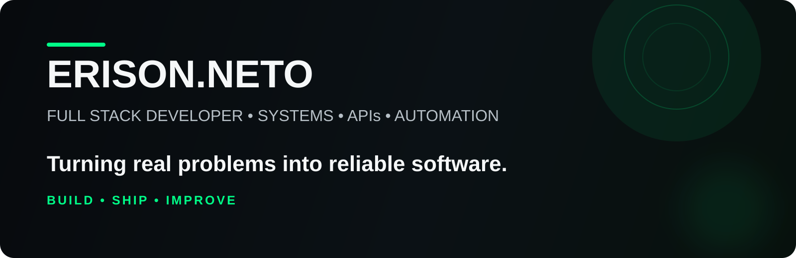

<p align="center">
  
</p>

<p align="center">
  <a href="https://www.rockettechbr.com.br/"><b>Rocket Tech</b></a>
  ·
  <a href="https://www.linkedin.com/in/erison-crispim-221116268">LinkedIn</a>
  ·
  <a href="https://www.instagram.com/erison.dev/">Instagram</a>
</p>

---

## Sobre mim

Sou **Full Stack Developer** e fundador da **Rocket Tech**.  
Construo aplicações web, sistemas, APIs e automações com foco em resolver problemas reais de negócio.

Gosto de projetos em que tecnologia deixa de ser só interface e passa a ter **regra de negócio, integração, dados e operação**.

---

## Stack principal

**Front-end**  
`React` `TypeScript` `JavaScript` `HTML` `CSS`

**Back-end**  
`Node.js` `Express` `Python` `FastAPI`

**Banco & infraestrutura**  
`PostgreSQL` `Supabase` `MySQL` `SQLite` `Vercel`

**Outros**  
`Git` `GitHub` `REST APIs` `Automação` `Integrações`

---

## Projetos em destaque

### Rocket Tech
Site institucional e base digital da minha empresa de tecnologia.  
**Foco:** presença digital, performance, serviços e conversão.

### Old Brother
Sistema full stack para hamburgueria com mesas, pedidos, cozinha, caixa, delivery, estoque e relatórios.  
**Stack:** React, Vite, Node.js, Express, PostgreSQL/Supabase.

### Rocket Ads
API interna para análise de campanhas com integração ao Google Ads e Google Analytics.  
**Foco:** campanhas, palavras-chave, termos de pesquisa, conversões e oportunidades de otimização.

### LegalBot CNJ
Automação para consulta diária de comunicações processuais, geração de relatórios em PDF/Excel e envio por e-mail.  
**Foco:** automação jurídica, agendamento, relatórios e confiabilidade operacional.

---

## Como eu penso software

```text
problema real
    ↓
regra de negócio
    ↓
arquitetura simples e clara
    ↓
implementação
    ↓
teste e validação
    ↓
entrega
```

---

## Em evolução

Atualmente aprofundando conhecimentos em:

- arquitetura de software
- APIs e integrações
- back-end
- automação
- sistemas orientados a negócio

---

<p align="center">
  <b>Construindo software útil, um projeto de cada vez.</b>
</p>
